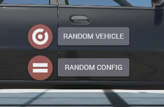

# Vehicle Randomizer (BeamNG.Drive game mod)
Made as a personal project, this mod for the driving simulator BeamNG.Drive adds a UI app to the game that allows users to spawn a random vehicle (of which the game includes many) with some options for setting parameters. The game has no user-accessible way of doing this otherwise, and letting the computer choose a car for you can lead to more interesting gameplay in many scenarios.

|  |  |
|--|--|
|  |  |

The interface is implemented through HTML using Angular to communicate with the game's LUA engine. Using the toggle buttons as parameters for the LUA scripts, the mod is able to spawn vehicles in three different ways. Pressing the RANDOM VEHICLE button will spawn a random vehicle from the game in its default configuration (Every car in the game supports many configurations, such as different trim levels and customized examples). This is done by pulling the full list of vehicles in the game from the LUA engine and selecting a model key at random.

Pressing RANDOM CONFIG with the "Equals" option disabled pulls the full list of configurations and selects a random entry from that to spawn. This presented a problem, since there are no limits to how many configurations a single model of vehicle can have, vehicles with many configurations would dominate the list and frequently stop vehicles with less configurations from appearing. The "equals" option solves this by randomly selecting a vehicle's dictionary key first (enforcing fairness since every vehicle only has one key), using it to filter the list of configurations to that vehicle only, and selecting randomly from there. 

(The other toggle button is a simple filter. BeamNG supports importing vehicles from a different car design simulator game, however these often do not support configurations in the way first-party vehicles do, so filtering them out can be desirable when choosing random configurations.)

|  |  |
|--|--|
|  |  |