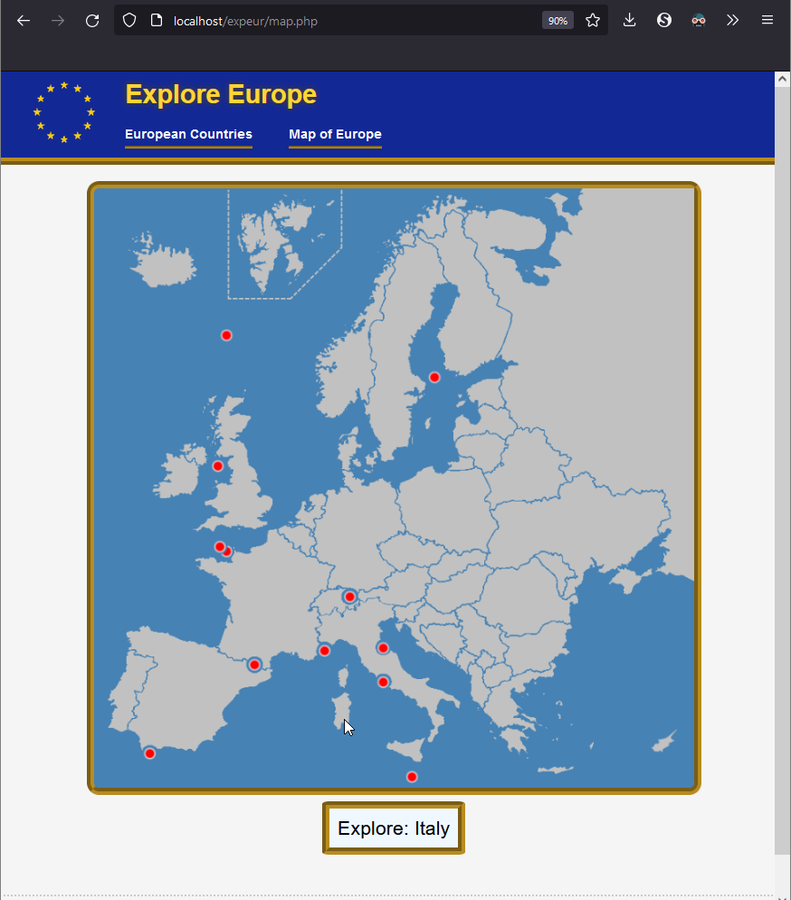

# "Explore Europe" Interactive Map Page
The Explore Europe website was created for a Web Technology class final project. Working in a team of three, my primary responsibility was to create this interactive map page. Using multiple HTML canvases, the areas of the map are defined to each country on a per-pixel basis, making selection of smaller nations as accurate as possible. In the original project, clicking a country would load a page of information on the chosen country, however the API used for that does not seem to be functional anymore.

|  |  ||
|--|--|--|
|  |  |  |
