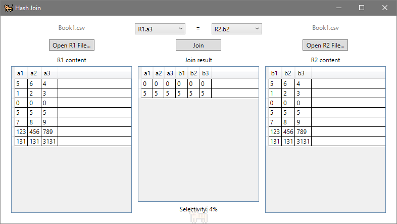

# Hash Join App
Program written for a Database Management Systems class to preform hash joins on a pair of datasets. The entire program was written using WPF and C#. The app can load two different (or the same, why not) appropriately constructed CSV files and perform the join using any of the columns available on either set. A selectivity indicator at the bottom on the window gives a percentage of how many fields matched and were joined.

|  |  |
|--|--|
|  |   |
