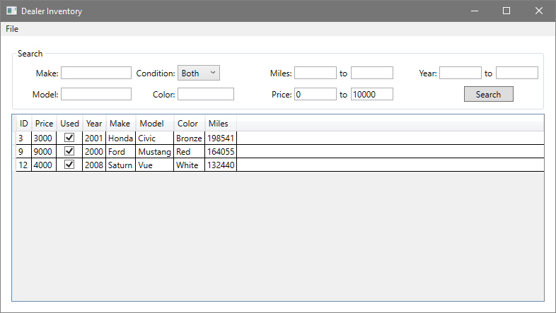

# Car Dealer Inventory Manager
Program written for a Software Architecture & Design Patterns class for practice designing a UI using the Model/View/Controller pattern. The entire program was written using WPF and C#.

|  |  |  |
|--|--|--|

The app provides two modes: a customer view and a dealer view. Both views show a list of available vehicles in the inventory. The customer view includes tools to filter the list by various attributes, such as make, model, year, mileage, color, etc. Multiple filters may be used together. Under the file menu is a login option to enter the dealer view (credentials: admin / 13579). The dealer view includes and interface to add, modify, or remove vehicles from the list.

|  |  |  |  |
|--|--|--|--|
|  |  |  |  |

