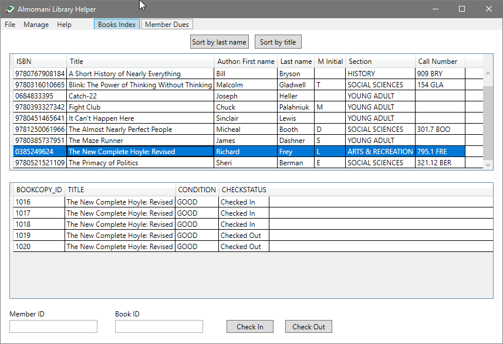
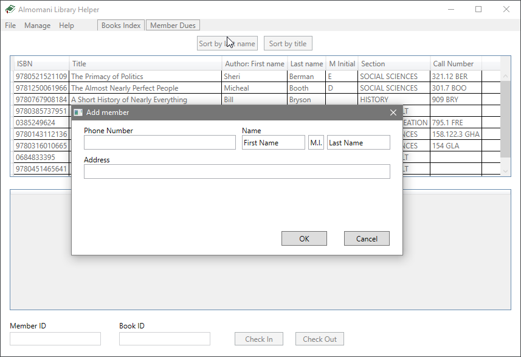
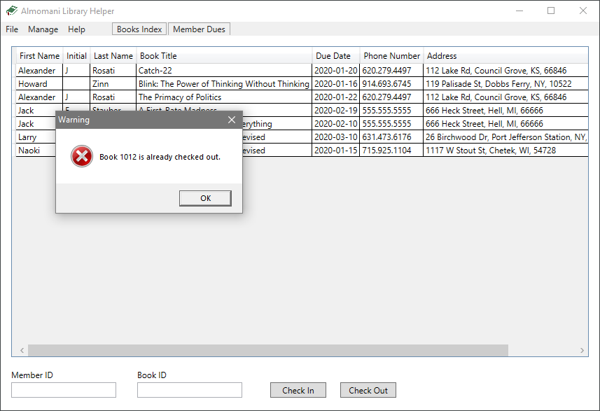

# Library Database Interface App
Created for a Database Management Systems class, I worked with a partner to design and implement a simple database for a library to manage books, book copies, members, and dues, along with a desktop application used to interact with said database. I wrote the entire app and worked with my partner (who designed the database itself) to write the appropriate SQL queries for the app to use to communicate with our SQL Server database. 

The app is able to add and remove books and individual book copies, register or delete members, update relevant information on books (such as condition) or members (like phone numbers or addresses), and check books in or out to members. 

|  |  |
|--|--|
|  |  |

All of these actions are reflected in the SQL Server Database and have protections on both the interface end and the database end to avoid creating invalid data.

