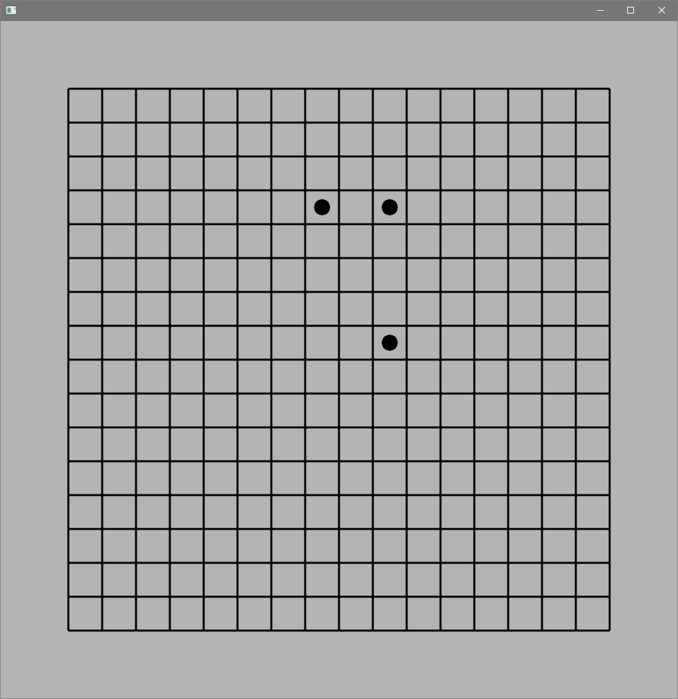
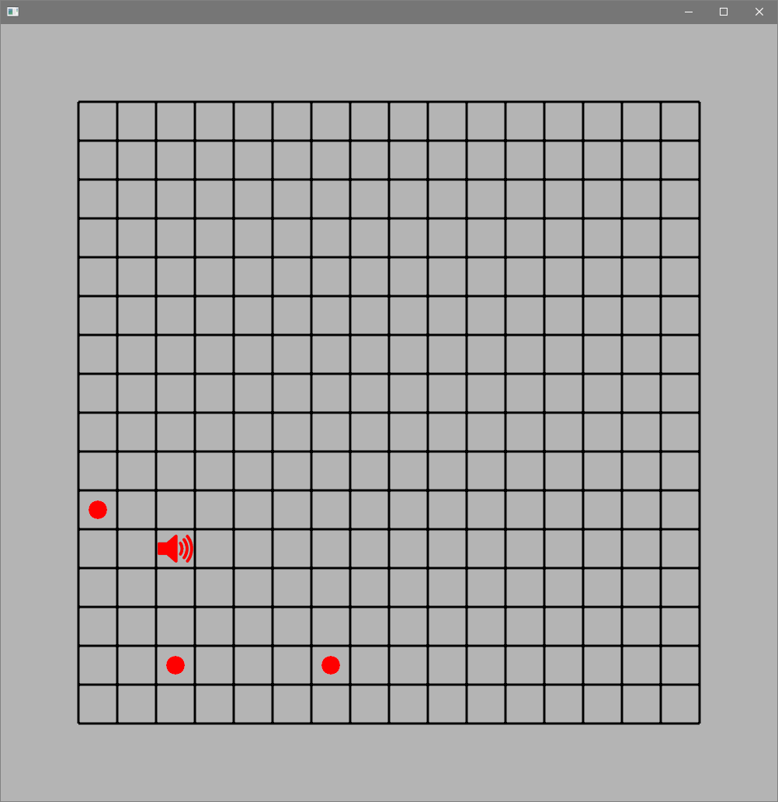

# Simple Message Bus Implementation
Program written for a Software Architecture & Design Patterns class showing a visual example of a message bus (called data bus in the program). 

Three dots (called scouts) exist on a grid. They are constantly informing each other of their respective positions on the grid through the message bus. Scouts are able to move around the grid by one space every half second. 

Clicking on a space on the grid will create a "sound" event, showing an icon on the grid at that location and sending an alert into the message bus. The scouts are able to read and react to this. A sound created by left clicking will make the scouts turn blue and move within a certain distance of the origin point, while a sound made by right clicking will cause the scouts to turn red and flee from the origin point for a few ticks. 

![The grid again. A black speaker icon is near the top right corner. The three dots are near the icon and moving towards it, all three are tinted blue. On the right of the screen is a command prompt showing all of the messages in the message bus as they come through. Two cycles worth of scouts reporting their positions is visible at the bottom of the log, with the "good sound" event above them. A green arrow (overlaid) points from the sound message event and the speaker on the grid, showing they are connected.](../_DemoImg/messageBus/soundMessage.png)

Scouts are able to occupy the same space as they move around the grid reacting to sounds. To prevent this, they check their own positions against the reported positions of other scouts. If there is a collision, both scouts involved will move randomly until their positions are unique.

