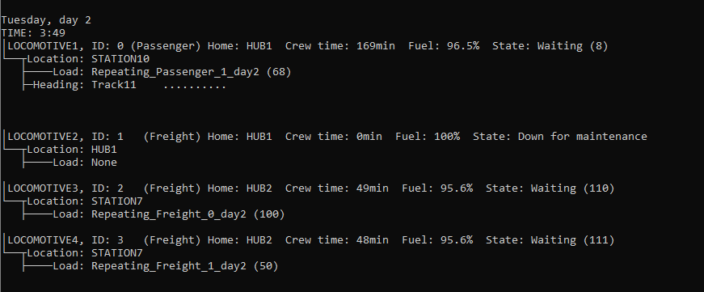

# Train Routing Simulation
Created for Software Engineering I in a small team, this program takes a network of rail lines, stations, trainyards, consists (trains), and scheduled loads/cargo bills and dispatches trains down optimal routes to complete each day's bills. The program will attempt to send each train on the best possible route while accounting for conflicting usage of shared rails, fuel limits, crew uptime limits, and downtime of trains and tracks due to maintenance.

My contribution to the project was the entire simulation, with other team members working on a GUI (unfortunately unused) and supporting programs that would use data from the simulation to analyze the performance of the railway and locate issues that could be improved upon. 

In place of the GUI, I implemented an optional detailed execution mode that gives a readout of what the simulation is currently doing, shown below. Each image's alt text contains a summary of what is displayed.

